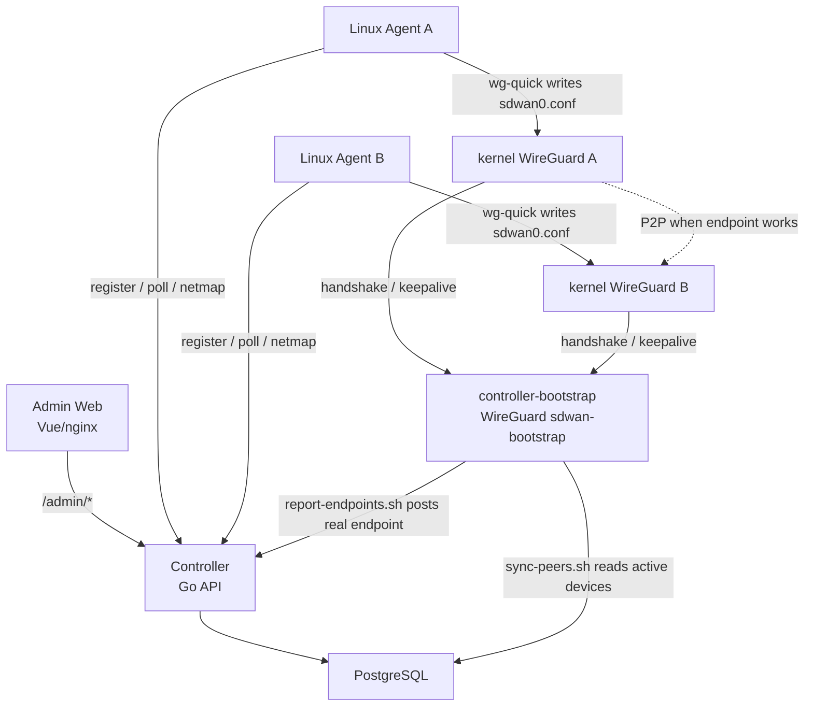

# SD-WAN Controller

`sdwan` 是一个最小版 Tailscale-like 产品骨架。当前版本是 `v1.1.6`，目标是先跑通账号注册、设备入网、虚拟 IP 分配、HTTP polling、Netmap 下发、Linux Agent 渲染 WireGuard 配置，以及通过 Bootstrap WireGuard Peer 获取真实 endpoint 的 MVP 闭环。

默认控制器域名：

```text
controller.englishlisten.cn
```

## 产品边界

第一版取消“区域”概念，一个账号就是一个独立 Overlay 网络。

- 用户通过邮箱注册和登录。
- 每个账号默认获得 `100.64.0.0/10` 下的独立 `/24` 地址池。
- 每个账号默认最多 254 台设备，自动避开 `.0` 和 `.255`。
- 登录后获得 `Admin Token`，它同时作为设备首次入网 Token。
- 设备注册成功后获得独立 `Device Token`，后续 `poll` 和 `netmap` 使用 Device Token。
- Controller 通过 HTTP polling 下发网络变化，暂不使用 WebSocket。
- 同一账号下设备默认全互通。

暂不做：ACL、MagicDNS、Exit Node、真实支付、WebSocket 推送、多 Controller 高可用。

## 技术路线

- Controller：Go、`net/http`、PostgreSQL、`pgx/v5`
- 查询层：sqlc 风格手写查询封装，后续可接入 `sqlc generate`
- 数据库：PostgreSQL
- 前端：Vue 3、Vite、原生 CSS，默认中文，可切换英文
- Agent：Go，Linux 侧调用系统 WireGuard 工具链
- 数据面：Linux kernel WireGuard、`wg`、`wg-quick`
- NAT endpoint：不再使用临时 STUN socket，改为 Bootstrap WireGuard Peer 公网侧观察
- 部署：Docker Compose
- 反向代理：生产环境由服务器上的独立 Caddy/Nginx 分流，本仓库不强制托管 Caddy

## 服务关系图



## MVP NAT 流程

这版删除 Agent 临时 STUN endpoint 探测。真实公网 endpoint 只通过公网 bootstrap 节点观察 kernel WireGuard socket 获得。

```text
1. Agent A 生成 WireGuard private/public key
2. Agent A 用 Admin Token 注册 Controller
3. Controller 保存 A public_key 和 virtual_ip
4. bootstrap 服务器运行 sync-peers.sh
5. sync-peers.sh 从 PostgreSQL 读取 active devices
6. sync-peers.sh 执行 wg set sdwan-bootstrap peer A_PUBLIC_KEY allowed-ips A_IP/32
7. Agent A poll/netmap 拿到 bootstrap_peer
8. Agent A 渲染 /etc/wireguard/sdwan0.conf
9. kernel WireGuard A 向 controller.englishlisten.cn:51872 发 handshake/keepalive
10. bootstrap 的 sdwan-bootstrap 看到 A 的真实公网 endpoint
11. report-endpoints.sh 读取 wg show sdwan-bootstrap dump
12. report-endpoints.sh 调用 /api/v1/bootstrap/endpoints 回写 Controller
13. Controller 保存 endpoint_type=bootstrap
14. Agent B 下一轮 netmap 拿到 A 的 bootstrap endpoint
15. A/B 尝试 WireGuard P2P
```

核心原则：

```text
临时 STUN socket 得到的 endpoint 不可信。
bootstrap 看到的是 kernel WireGuard socket 发出来的真实公网 endpoint。
```

## 本地 Docker Compose

```bash
docker compose up -d --build
```

本地端口：

```text
Web:        http://localhost:8081
Controller: http://localhost:18080
```

生产建议分流：

```text
https://controller.englishlisten.cn/        -> Web
https://controller.englishlisten.cn/api/*   -> Controller
https://controller.englishlisten.cn/admin/* -> Controller
udp://controller.englishlisten.cn:51872     -> bootstrap WireGuard
```

查看日志：

```bash
docker compose logs -f controller
docker compose logs -f web
```

## 数据库设计

| 表 | 作用 |
| --- | --- |
| `users` | 用户账号、Overlay 地址池、套餐 code、设备上限、netmap 版本 |
| `admin_sessions` | 登录会话，保存 Admin Token hash |
| `plans` | 套餐定义 |
| `subscriptions` | 用户套餐订阅，当前预留 |
| `devices` | 设备节点，保存 public key、virtual IP、Device Token hash |
| `device_endpoints` | 设备 endpoint，当前主要存 `lan` 和 `bootstrap` |
| `subnet_routes` | 快启子网服务预留表 |
| `relays` | 自建 Relay 预留表 |
| `audit_logs` | 操作日志预留表 |

地址分配保护：

```text
1. users.overlay_cidr UNIQUE 保证账号地址池不重复
2. 创建账号时使用 PostgreSQL pg_advisory_xact_lock 串行分配 /24
3. devices(user_id, virtual_ip) UNIQUE 保证同账号下设备 IP 不重复
4. 设备 IP 从 /24 内逐个分配，并跳过 .0 和 .255
```

## Bootstrap WireGuard Peer

Controller 环境变量：

```text
BOOTSTRAP_WG_PUBLIC_KEY   bootstrap WireGuard 公钥
BOOTSTRAP_WG_ENDPOINT     bootstrap WireGuard 公网地址，例如 controller.englishlisten.cn:51872
BOOTSTRAP_WG_ALLOWED_IP   默认 100.254.254.254/32
BOOTSTRAP_REPORT_TOKEN    bootstrap 节点回写 endpoint 使用的 Bearer token
```

客户端 netmap 会包含：

```json
{
  "bootstrap_peer": {
    "device_id": "bootstrap",
    "hostname": "controller-bootstrap",
    "virtual_ip": "100.254.254.254",
    "allowed_ips": ["100.254.254.254/32"],
    "endpoints": ["controller.englishlisten.cn:51872"],
    "persistent_keepalive": 25
  }
}
```

### 同步客户端公钥到 bootstrap

在 controller/bootstrap 服务器上执行：

```bash
sudo BOOTSTRAP_WG_INTERFACE=sdwan-bootstrap \
  POSTGRES_CONTAINER=sdwan-postgres-1 \
  POSTGRES_USER=sdwan \
  POSTGRES_DB=sdwan \
  /opt/sdwan/deploy/bootstrap/sync-peers.sh
```

脚本会读取数据库里所有 active 设备：

```sql
SELECT public_key, host(virtual_ip)
FROM devices
WHERE status = 'active';
```

然后执行：

```bash
wg set sdwan-bootstrap peer "$public_key" allowed-ips "$virtual_ip/32" persistent-keepalive 25
```

### 回写真实 endpoint

```bash
sudo BOOTSTRAP_WG_INTERFACE=sdwan-bootstrap \
  CONTROLLER_URL=https://controller.englishlisten.cn \
  BOOTSTRAP_REPORT_TOKEN=your_report_token \
  /opt/sdwan/deploy/bootstrap/report-endpoints.sh
```

脚本读取：

```bash
wg show sdwan-bootstrap dump
```

并把每个 peer 的 `public_key + endpoint` 回写到：

```text
POST /api/v1/bootstrap/endpoints
```

建议用 systemd timer 或 cron 每 10 到 30 秒执行一次：

```text
sync-peers.sh
report-endpoints.sh
```

## API

### 查询版本

```bash
curl http://localhost:18080/api/v1/server/version
```

### 邮箱注册

```bash
curl -X POST http://localhost:18080/admin/auth/register \
  -H "Content-Type: application/json" \
  -d '{"email":"admin@example.com","password":"password123"}'
```

### 邮箱登录

```bash
curl -X POST http://localhost:18080/admin/auth/login \
  -H "Content-Type: application/json" \
  -d '{"email":"admin@example.com","password":"password123"}'
```

### 当前账号

```bash
curl http://localhost:18080/admin/auth/me \
  -H "Authorization: Bearer sdwan_admin_xxx"
```

### 控制台总览

```bash
curl http://localhost:18080/admin/account \
  -H "Authorization: Bearer sdwan_admin_xxx"
```

### 设备列表

```bash
curl http://localhost:18080/admin/devices \
  -H "Authorization: Bearer sdwan_admin_xxx"
```

### 设备详情

```bash
curl http://localhost:18080/admin/devices/dev_xxx \
  -H "Authorization: Bearer sdwan_admin_xxx"
```

### 设备注册

```bash
curl -X POST http://localhost:18080/api/v1/devices/register \
  -H "Content-Type: application/json" \
  -d '{
    "admin_token": "sdwan_admin_xxx",
    "hostname": "linux-01",
    "os": "linux",
    "arch": "amd64",
    "public_key": "wireguard-public-key",
    "client_version": "v1.1.6"
  }'
```

### 设备 Polling

```bash
curl -X POST http://localhost:18080/api/v1/devices/poll \
  -H "Authorization: Bearer sdwan_device_xxx" \
  -H "Content-Type: application/json" \
  -d '{
    "current_netmap_version": 1,
    "client_version": "v1.1.6",
    "endpoints": [
      {"type":"lan","addr":"192.168.1.10:41641","source":"eth0"}
    ]
  }'
```

### 获取 Netmap

```bash
curl http://localhost:18080/api/v1/netmap \
  -H "Authorization: Bearer sdwan_device_xxx"
```

### Bootstrap endpoint 回写

```bash
curl -X POST http://localhost:18080/api/v1/bootstrap/endpoints \
  -H "Authorization: Bearer your_report_token" \
  -H "Content-Type: application/json" \
  -d '{"public_key":"client-public-key","endpoint":"111.228.42.62:37425"}'
```

## Linux Agent

安装脚本：

```bash
curl -fsSL https://controller.englishlisten.cn/install.sh | sudo sh
```

注册设备：

```bash
sudo sdwan-agent register \
  --controller https://controller.englishlisten.cn \
  --admin-token sdwan_admin_xxx
```

启动 daemon：

```bash
sudo systemctl enable --now sdwan-agent
```

Agent 运行流程：

```text
1. 加载 /etc/sdwan/agent.json
2. 检测 LAN endpoints
3. 调用 /api/v1/devices/poll
4. 如果 netmap_changed=true，拉取 /api/v1/netmap
5. 渲染 /etc/wireguard/sdwan0.conf
6. 执行 wg-quick down/up
7. 更新本地 netmap_version
8. 等待 poll_interval_seconds 后进入下一轮
```

构建 Linux Agent 二进制：

```bash
docker run --rm \
  -v /opt/sdwan:/src \
  -w /src \
  -e GOPROXY=https://goproxy.cn,direct \
  golang:1.25-alpine \
  sh -c 'mkdir -p downloads/v1.1.6 && GOOS=linux GOARCH=amd64 go build -o downloads/v1.1.6/sdwan-agent-linux-amd64 ./cmd/agent'
```

## 验证

```bash
go test ./...

cd web
npm run build
```

## 后续路线

1. Controller 自动触发 bootstrap peer 同步，减少脚本依赖。
2. 加入 Relay fallback，解决 symmetric NAT 和 UDP 直连失败场景。
3. 实现 `subnet_routes` 的审批、下发和 Agent 路由配置。
4. 增加设备禁用、删除、重命名。
5. 增加 Windows Agent。
6. 稳定后再考虑 WebSocket 推送替换 HTTP polling。
