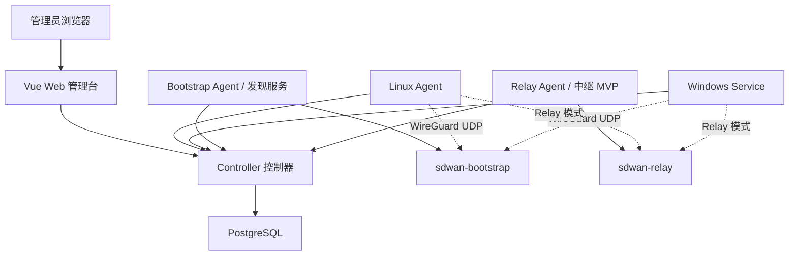

# SD-WAN 架构文档索引

本文档集基于 `v1.2.0` 当前代码整理，按服务器端和客户端拆分。

服务器和客户端的完整安装步骤见 [部署手册](../deployment.md)。

## 文档划分

服务器端分为三个部分：

1. [控制器服务](server-controller.md)
2. [发现服务](server-discovery.md)
3. [中继服务](server-relay.md)

客户端分为两个部分：

1. [Linux 客户端](client-linux.md)
2. [Windows 客户端](client-windows.md)

## 总体关系

## 当前产品边界

- Controller 负责身份、套餐、设备、虚拟 IP、netmap、endpoint、子网路由和 Relay 元数据。
- Linux 和 Windows 客户端负责本机 WireGuard 数据面。
- Bootstrap 发现服务通过服务端 WireGuard 观察客户端真实公网 endpoint。
- Relay 支持按客户端独立的直连优先自动 fallback；当前仍限定单主站点和单活动自建 Relay。
- 当前不是 Tailscale magicsock、DERP 或 userspace NAT traversal 的完整复刻。
- 暂无 ACL、MagicDNS、Exit Node 和生产级多 Relay 调度。
