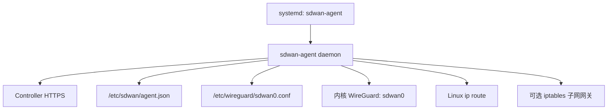
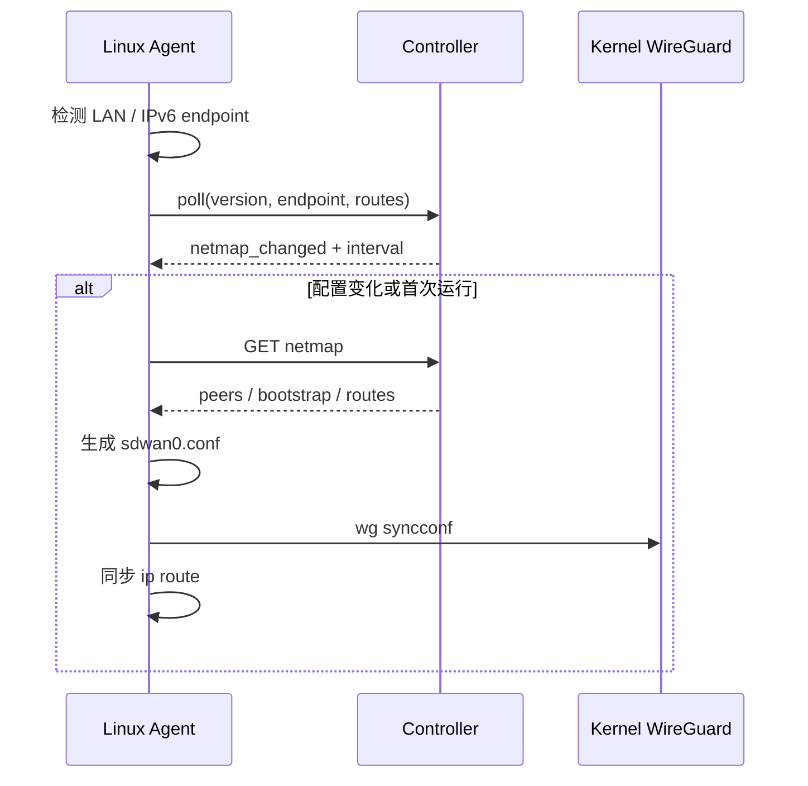

# 客户端：Linux Agent

## 1. 定位

Linux Agent 是控制平面与 Linux 内核 WireGuard 之间的适配层。

它负责：

- 首次设备注册和 WireGuard 密钥生成。
- 保存 Device Token 和设备私钥。
- 定期 poll Controller。
- 上报 LAN/IPv6 endpoint 和发布的子网路由。
- 拉取 netmap、生成 WireGuard 配置并应用。
- 维护系统路由。
- 可选配置 Linux 子网网关转发和 NAT。

主要代码：

```text
cmd/agent/main.go
internal/agent/
deploy/install/install.sh
deploy/systemd/sdwan-agent.service
```

## 2. 运行结构



默认值：

```text
配置：/etc/sdwan/agent.json
WireGuard 配置：/etc/wireguard/sdwan0.conf
接口：sdwan0
UDP：41641
轮询：Controller 默认 15 秒
```

## 3. 注册流程

```bash
sudo sdwan-agent register \
  --controller https://controller.englishlisten.cn \
  --admin-token sdwan_admin_xxx
```

注册时：

1. 本地生成 Curve25519/WireGuard 私钥和公钥。
2. 只把公钥、设备信息和客户端版本发给 Controller。
3. Controller 分配虚拟 IP 和 Device Token。
4. Agent 将私钥、Device Token 和设备状态保存到 `agent.json`。
5. 私钥不会上传到 Controller。

配置文件权限为 `0600`，目录权限为 `0700`。

## 4. 守护进程同步流程



Endpoint 检测：

- 上报 RFC1918 LAN IPv4。
- 上报非私有 IPv6。
- 忽略 loopback、Docker、bridge、veth 和 virbr 等接口。
- 不进行临时 STUN 探测。
- 公网 endpoint 由 Bootstrap 服务观察并回写。

## 5. WireGuard 配置应用

首次启动：

- 如果 `sdwan0` 不存在，执行 `wg-quick up`。

后续更新：

- 使用 `wg-quick strip` 生成纯 WireGuard 配置。
- 使用 `wg syncconf sdwan0 /dev/stdin` 无中断更新 peer。
- 通过 `ip route replace/delete` 增删 AllowedIPs 路由。
- 只有 `syncconf` 失败时才回退到 `wg-quick down/up`。

这样多数 netmap 变化不会中断已有隧道。

## 6. 拓扑行为

普通模式：

- 普通客户端只连接 `main_site`。
- 主站点连接账户内所有普通客户端。
- 客户端同时配置固定 Bootstrap peer。
- 已审批子网路由作为主站点 peer 的 AllowedIPs 下发。

Relay 模式：

- 客户端主要 peer 变为活动 Relay。
- 账户 overlay CIDR 和相关子网 CIDR 都指向 Relay。
- Relay 是否启用由 Controller 的账户级开关决定，不是客户端自动判断。

## 7. 子网路由

维护发布列表：

```bash
sudo sdwan-agent routes list
sudo sdwan-agent routes add 192.168.50.0/24
sudo sdwan-agent routes remove 192.168.50.0/24
```

约束：

- 设备必须被设为 `main_site`。
- 账户套餐必须支持子网路由。
- Controller 管理员需要审批。

开启本机子网网关：

```bash
sudo sdwan-agent subnet-gateway enable \
  --lan-cidr 192.168.50.0/24 \
  --out-interface eth0
```

该命令会：

- 开启 IPv4 forwarding。
- 写入持久化 sysctl 配置。
- 增加 overlay 到 LAN 的 MASQUERADE。
- 增加 WireGuard 到 LAN 的 FORWARD。
- 允许 LAN 返回的 RELATED/ESTABLISHED 流量。

检查或关闭：

```bash
sudo sdwan-agent subnet-gateway status \
  --lan-cidr 192.168.50.0/24 \
  --out-interface eth0

sudo sdwan-agent subnet-gateway disable \
  --lan-cidr 192.168.50.0/24 \
  --out-interface eth0
```

## 8. 常用命令

```text
register          首次注册
poll              手工执行一次 poll
netmap            查看 Controller 下发内容
render            仅生成 WireGuard 配置
up                生成并应用配置
down              关闭 sdwan0
daemon            长期运行并自动同步
routes            管理 advertise_routes
subnet-gateway    管理 Linux 转发和 NAT
version           查看版本
```

安装并运行：

```bash
curl -fsSL https://controller.englishlisten.cn/install.sh | sudo sh
sudo sdwan-agent register \
  --controller https://controller.englishlisten.cn \
  --admin-token sdwan_admin_xxx
sudo systemctl enable --now sdwan-agent
```

## 9. 依赖

- Linux root 权限。
- `wireguard-tools`：`wg`、`wg-quick`。
- `iproute2`：`ip`。
- 子网网关需要 `iptables`。
- UDP 出站以及需要直连时的入站策略允许 WireGuard 流量。

## 10. 故障排查

```bash
systemctl status sdwan-agent --no-pager
journalctl -u sdwan-agent -n 100 --no-pager
cat /etc/sdwan/agent.json
cat /etc/wireguard/sdwan0.conf
wg show sdwan0
ip addr show sdwan0
ip route show dev sdwan0
```

典型问题：

- 没有 peer：检查设备是否已注册、主站点是否设置、netmap 是否变化。
- 有 peer 无握手：检查 endpoint、UDP、防火墙、公钥和 Bootstrap 状态。
- 能访问 overlay 但不能访问 LAN：检查路由审批、IP forwarding、iptables 和 LAN 回程。
- 配置更新中断：查看是否 `wg syncconf` 失败并触发了 down/up 回退。

## 11. 当前限制

- 无自动 Relay fallback。
- 无主动网络质量测量和最佳 endpoint 动态选择。
- WireGuard 配置只使用每个 peer endpoint 列表的第一个地址。
- 无本地 DNS 集成、ACL 和设备密钥轮换。
- iptables 方案尚未抽象 nftables/firewalld/ufw 差异。
