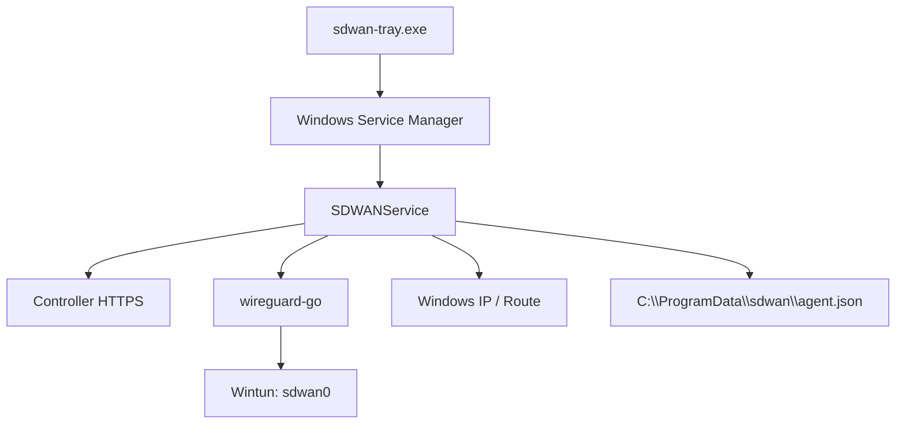

# 客户端：Windows Agent

## 1. 定位

当前推荐的 Windows 客户端采用：

```text
sdwan-tray.exe
  -> SDWANService / sdwan-service.exe
  -> wireguard-go
  -> Wintun
```

不要求用户额外安装 WireGuard for Windows。后台服务在进程内运行 userspace WireGuard，并通过 `wintun.dll` 创建虚拟网卡。

主要代码：

```text
cmd/windows-service/main.go
cmd/windows-tray/main.go
deploy/windows/README.md
```

仓库中的通用 `sdwan-agent.exe` 仍保留旧的 WireGuard for Windows 路线，但正式 Windows 产品优先使用 `sdwan-service.exe + sdwan-tray.exe`。

## 2. 运行结构



默认值：

```text
服务名：SDWANService
显示名：SD-WAN Service
配置：C:\ProgramData\sdwan\agent.json
接口：sdwan0（实际名称以 Wintun 返回为准）
UDP：41642
```

## 3. 文件组成

建议发布目录包含：

```text
sdwan-service.exe
sdwan-tray.exe
wintun.dll
```

职责：

- `sdwan-service.exe`：注册、Controller 通信、WireGuard、Wintun、IP 和路由。
- `sdwan-tray.exe`：用户入口、注册、连接、断开、重启、开机启动和状态显示。
- `wintun.dll`：Wintun 运行库，必须与 Service 可执行文件放在同目录。

## 4. 注册流程

命令行注册：

```powershell
.\sdwan-service.exe register `
  --controller https://controller.englishlisten.cn `
  --admin-token sdwan_admin_xxx
```

流程与 Linux 相同：

1. 本地生成 WireGuard 密钥对。
2. 上传公钥和设备信息。
3. 获取虚拟 IP 和 Device Token。
4. 保存到 `C:\ProgramData\sdwan\agent.json`。
5. 默认监听 UDP 41642。

托盘中的 Join 操作会调用相同注册命令。

## 5. Windows Service 同步

Service 循环执行：

1. 读取本地配置。
2. 检测 LAN 和 IPv6 endpoint。
3. 调用设备 poll。
4. netmap 未变化且 WireGuard 已启动时保持现状。
5. netmap 变化时拉取最新配置。
6. 首次运行创建 Wintun 设备。
7. 将 netmap 转为 WireGuard UAPI 配置并调用 `IpcSet`。
8. 配置虚拟 IP、MTU 和 Windows 路由。
9. 保存 `netmap_version` 和 `last_routes`。

与旧的“生成配置后重装 WireGuard tunnel service”相比，当前 Service 可在进程内更新 peer，不需要每次重新安装隧道服务。

## 6. WireGuard 和路由

- WireGuard 使用 Go userspace 实现。
- Wintun 创建三层虚拟网卡。
- Service 将设备虚拟 IP 配置到网卡。
- 根据 netmap 的 AllowedIPs 增加 Windows 路由。
- 删除 netmap 已移除的旧路由。
- 固定 Bootstrap 地址 `100.254.254.254/32` 也会进入路由检查范围。

普通模式和 Relay 模式由 Controller 下发的 netmap 决定，Windows 客户端无需单独理解业务套餐。

## 7. 托盘功能

当前 Go 托盘提供：

```text
Join                 使用 Admin Token 注册
Connect              安装并启动 SDWANService
Restart Service      重启服务并触发同步
Disconnect           停止服务
Auto Start            控制服务自动启动
Edit Configuration   打开配置文件
Open Data Folder      打开数据目录
Start with Windows    管理托盘程序开机启动
About                 显示版本
Quit                  退出托盘，不等于卸载服务
```

托盘只是管理入口，实际隧道生命周期由 Windows Service 承担。

## 8. Service 命令

```powershell
.\sdwan-service.exe register --controller URL --admin-token TOKEN
.\sdwan-service.exe install-service
.\sdwan-service.exe start-service
.\sdwan-service.exe stop-service
.\sdwan-service.exe uninstall-service
.\sdwan-service.exe run
.\sdwan-service.exe sync
.\sdwan-service.exe down
.\sdwan-service.exe status
.\sdwan-service.exe diagnose
.\sdwan-service.exe version
```

安装和启动需要管理员 PowerShell：

```powershell
.\sdwan-service.exe install-service --auto-start=true
.\sdwan-service.exe start-service
```

## 9. Diagnose 能力

`diagnose` 会检查：

- 配置文件是否存在。
- Service 是否已安装、是否运行。
- `wintun.dll` 是否存在。
- Wintun 接口是否存在。
- 虚拟 IPv4 是否配置。
- overlay 和 Bootstrap 路由是否存在。
- WireGuard UDP 端口是否被使用。
- Controller poll 是否可达。
- 当前保存的 `last_routes`。

使用：

```powershell
.\sdwan-service.exe diagnose
```

## 10. Endpoint 与发现

Windows 与 Linux 共用 endpoint 检测逻辑：

- 上报 LAN 私网 IPv4。
- 上报公网 IPv6。
- 不使用临时 STUN socket。
- 真实公网 WireGuard endpoint 由 Bootstrap 服务观察。

Windows 客户端会连接 Controller 下发的固定 Bootstrap peer，让服务端看到 UDP 41642 经 NAT 后的真实公网映射。

## 11. 当前不支持

- Windows 子网网关和 LAN NAT。
- 自动 Relay fallback。
- 多 Relay 选择和连接质量判断。
- ACL、MagicDNS、Exit Node。
- 完整 MSI 安装包、自动升级和代码签名流程。

Windows 可以作为普通节点访问 Linux 主站点发布的子网，但不能作为发布 LAN 子网的主站点网关。

## 12. 故障排查

管理员 PowerShell：

```powershell
.\sdwan-service.exe status
.\sdwan-service.exe diagnose
Get-Service SDWANService
Get-NetAdapter
Get-NetIPAddress -AddressFamily IPv4
Get-NetRoute
```

重点检查：

- `wintun.dll` 与 Service 是否同目录。
- 是否以管理员权限安装和运行服务。
- `C:\ProgramData\sdwan\agent.json` 是否有效。
- Controller 地址和 Device Token 是否正确。
- Windows 防火墙是否阻止 UDP 41642。
- Bootstrap 和 Relay 公网端口是否可达。
- Wintun 网卡是否获得正确虚拟 IP 和路由。

## 13. 后续建议

- 制作签名 MSI，统一安装 Service、Tray 和 Wintun。
- 增加 Service 日志文件和 Windows Event Log 结构化事件。
- 增加自动升级和版本回滚。
- 在托盘展示连接 peer、握手时间、收发流量和当前路径。
- 实现直连与 Relay 的自动质量检测和切换。
