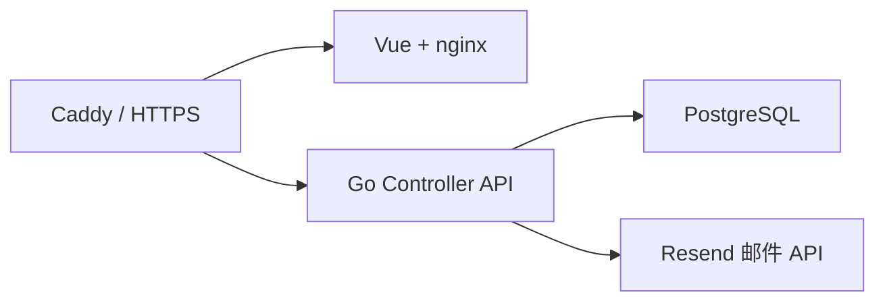

# 服务器端：控制器服务

## 1. 定位

Controller 是整个 SD-WAN 的控制平面。它不直接转发业务流量，也不应在容器内操作宿主机 WireGuard；它负责生成和维护数据面运行所需的状态。

主要入口：

```text
cmd/controller/main.go
internal/httpapi/router.go
internal/app/service.go
internal/storage/
db/migrations/
```

## 2. 运行组件



生产环境通常包含：

- `controller`：Go HTTP 服务，宿主机端口 `127.0.0.1:18080`。
- `web`：Vue 静态管理台，宿主机端口 `127.0.0.1:8081`。
- `postgres`：持久化业务状态。
- `Caddy`：TLS、域名入口、反向代理和安装包下载。

Controller 启动时通过 `golang-migrate` 自动执行嵌入式 migration。

## 3. 核心职责

### 3.1 账户与认证

- 使用邮箱和密码注册、登录。
- 注册前通过 Resend 发送一次性邮箱验证码。
- 验证码只保存 hash，包含有效期、发送冷却时间和最大尝试次数。
- 相同邮箱由数据库唯一约束和业务检查共同阻止重复注册。
- 登录后生成 Admin Token，数据库只保存 token hash。
- Admin Token 同时作为设备首次入网凭证。

### 3.2 网络隔离与地址分配

- 一个账户对应一个逻辑 overlay 网络。
- 每个账户从 `100.64.0.0/10` 中分配一个独立 `/24`。
- 账户 CIDR 分配使用 PostgreSQL advisory transaction lock，避免并发重复。
- 设备从账户 `/24` 中分配 `/32` 地址，跳过 `.0` 和 `.255`。
- 数据库通过 `UNIQUE(user_id, virtual_ip)` 保证最终唯一性，业务层在冲突时重试。
- 默认最大设备数为 254。

### 3.3 设备生命周期

设备首次注册流程：

```text
Admin Token
  -> POST /api/v1/devices/register
  -> 校验账户和设备额度
  -> 分配虚拟 IP
  -> 保存 WireGuard 公钥
  -> 返回 Device Token
```

后续设备使用 Device Token：

- 定期 `poll` 上报版本、系统版本、endpoint 和发布的子网路由。
- 根据 `netmap_version` 判断配置是否变化。
- 拉取 netmap，更新本机 WireGuard peer 和路由。
- 删除设备时同步提升账户 netmap 版本。

### 3.4 Netmap 生成

Netmap 是客户端数据面的期望状态，包含：

- 当前设备身份和站点角色。
- 可见 peer 的公钥、虚拟 IP、AllowedIPs 和 endpoint。
- Bootstrap 固定 peer。
- Relay 模式下的活动 Relay peer。
- 当前账户 `netmap_version`。

默认拓扑为 Hub-and-Spoke：

- 一个账户最多有一个活动 `main_site`。
- 普通客户端只看到主站点。
- 主站点看到所有普通客户端。
- 普通客户端之间默认不直接互相下发。
- Relay 模式开启后，客户端只连接活动 Relay，由 Relay 实现账户内转发。

### 3.5 Endpoint 管理

Controller 接收两类来源：

- 客户端上报：`lan`、`ipv6`、`manual`。
- Bootstrap 发现服务上报：`bootstrap`。

当前策略：

- 不接受旧的临时 STUN 探测结果。
- 每台设备、每种 endpoint 类型最多保留最近 3 个。
- endpoint 变化会提升账户 `netmap_version`。
- 下发优先级为：`bootstrap > manual > lan > ipv6 > unknown`。

### 3.6 子网路由

- 只有 `main_site` 可以发布 `advertise_routes`。
- 只支持 IPv4 CIDR。
- 禁止和 `100.64.0.0/10` overlay 地址池重叠。
- 路由先进入待审批状态，管理员审批后才进入 netmap。
- 普通客户端通过主站点访问被批准的 LAN 子网。
- Linux 主站点负责开启 IP forwarding、iptables FORWARD 和 MASQUERADE。
- Windows 当前不能作为子网网关。

### 3.7 套餐与免费升级

当前套餐：

| code | 产品 | 价格 | 子网路由 | 自建 Relay |
|---|---|---:|---|---|
| `free` | 基础组网 | 0 | 否 | 否 |
| `subnet` | 快启子网服务 | 9.9 元 | 是 | 否 |
| `relay` | 自行搭建 Relay | 29.9 元 | 是 | 是 |

免费升级规则：

- 可免费升级 `subnet` 或 `relay`，累计最多 12 个月。
- 从免费 `subnet` 提升到 `relay` 时不增加月份，只提升能力。
- 订阅过期后账户恢复 `free`。
- 当前还没有接入真实支付渠道。

### 3.8 Relay 管理

Controller 已具备：

- 创建 Relay 元数据和一次性展示 Relay Token。
- 启用、禁用 Relay。
- 账户级开启或关闭 Relay 模式。
- 向 Relay Agent 下发账户内设备和子网 AllowedIPs。
- 接收 Relay 心跳并记录 `last_seen_at`。

这部分属于 Relay MVP 的控制平面，不等于生产级自动 fallback，详见 [中继服务](server-relay.md)。

## 4. 主要 API

公共接口：

```text
GET /healthz
GET /readyz
GET /api/v1/server/version
```

管理接口：

```text
POST /admin/auth/email-code
POST /admin/auth/register
POST /admin/auth/login
GET  /admin/auth/me
GET  /admin/account
GET  /admin/plans
GET  /admin/subscription
POST /admin/subscription/free-upgrade
POST /admin/subscription/cancel
GET  /admin/devices
GET  /admin/devices/{deviceID}
POST /admin/devices/{deviceID}/main-site
DELETE /admin/devices/{deviceID}
POST /admin/subnet-routes/{routeID}/approval
POST /admin/subnet-routes/{routeID}/disable
POST /admin/relays
POST /admin/relays/{relayID}/enable
POST /admin/relays/{relayID}/disable
POST /admin/relay-mode
```

设备接口：

```text
POST /api/v1/devices/register
POST /api/v1/devices/poll
GET  /api/v1/netmap
```

服务端 Agent 接口：

```text
GET  /api/v1/bootstrap/peers
POST /api/v1/bootstrap/endpoints
GET  /api/v1/relays/peers
POST /api/v1/relays/heartbeat
```

## 5. 数据模型

主要表：

| 表 | 用途 |
|---|---|
| `users` | 账户、CIDR、套餐、netmap 版本、Relay 模式 |
| `admin_sessions` | Admin Token hash 和有效期 |
| `email_verifications` | 邮箱验证码 hash 和消费状态 |
| `plans` | 套餐能力定义 |
| `subscriptions` | 订阅、免费升级月份和到期时间 |
| `devices` | 设备身份、公钥、虚拟 IP、角色和心跳 |
| `device_endpoints` | 设备可达地址 |
| `subnet_routes` | 发布、审批和生效的子网路由 |
| `relays` | 自建 Relay 公钥、地址、Token 和状态 |
| `audit_logs` | 预留的审计日志表 |

## 6. 安全边界

- 密码使用 bcrypt hash。
- Admin、Device、Bootstrap、Relay Token 均使用不同用途。
- 数据库保存 Token hash，不保存明文 Token。
- 邮箱验证码保存 hash，不保存明文验证码。
- Controller 不保存设备 WireGuard 私钥。
- Bootstrap Token 是全局服务凭证，应仅放在服务端。
- Relay Token 是账户 Relay 节点凭证，应独立生成和保护。

## 7. 当前限制和建议

- Admin Token 同时用于后台会话和设备首次入网，后期建议拆分 enrollment key。
- 设备 IP 分配目前依靠唯一约束和重试，后期可改为用户级事务锁或数据库分配函数。
- 无 ACL，账户内可见性只由 Hub-and-Spoke 或 Relay 模式决定。
- 无 MagicDNS、Exit Node、设备密钥轮换和细粒度审计。
- `/readyz` 当前与 `/healthz` 相同，没有深度检查数据库和依赖服务。
- 建议补充 API 限流、验证码防滥用、后台操作审计和指标监控。
