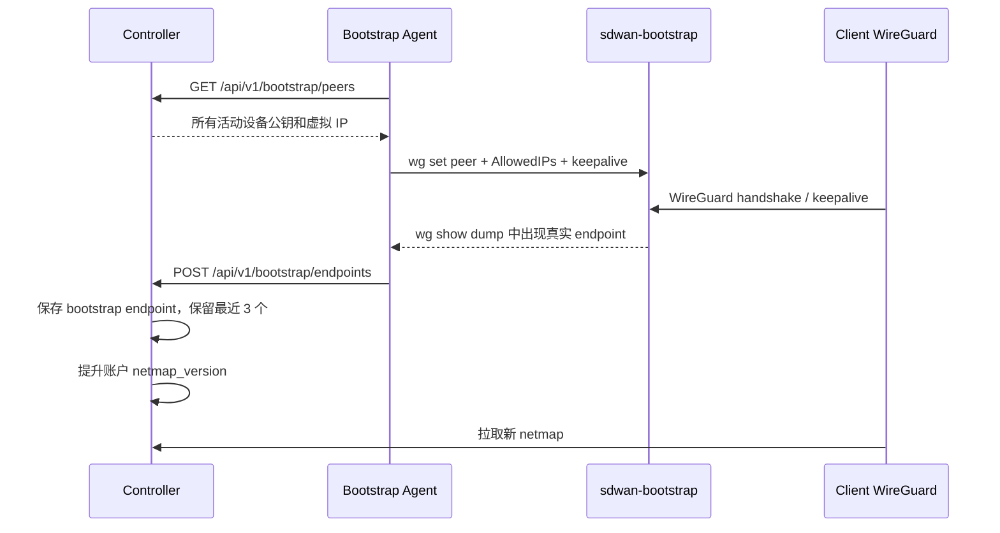

# 服务器端：发现服务

## 1. 定位

发现服务由固定公网 WireGuard 接口 `sdwan-bootstrap` 和常驻进程 `sdwan-bootstrap-agent` 组成。

它的核心目标是：**让服务端观察客户端内核 WireGuard socket 的真实公网 IP:port，并把该 endpoint 回写给 Controller。**

它不是 STUN 服务，也不是完整 Relay。

主要代码：

```text
cmd/bootstrap-agent/main.go
internal/bootstrapagent/
deploy/systemd/sdwan-bootstrap-agent.service
```

## 2. 为什么需要它

客户端位于 NAT 后时，本机通常只知道 LAN 地址，不知道 WireGuard UDP socket 经 NAT 后的公网映射。

不能使用临时 UDP socket 做 STUN 并把结果当成 WireGuard endpoint，因为：

```text
临时探测 socket != 内核 WireGuard socket
```

两者可能获得不同的 NAT 映射。当前方案让真正的 WireGuard socket 主动连接固定 Bootstrap peer，再由公网服务器观察真实来源地址。

## 3. 工作流程



默认周期：

- 每 5 秒同步一次设备 peer。
- 每 2 秒检查一次 endpoint 变化。
- 只在 endpoint 变化时回写 Controller。

## 4. 组件职责

### 4.1 Controller

- 使用 `BOOTSTRAP_REPORT_TOKEN` 认证 Bootstrap Agent。
- 返回所有账户的活动设备，而不是单个账户。
- 根据设备公钥定位设备。
- 将观察结果保存为 `endpoint_type=bootstrap`。
- 每台设备最多保留最近 3 个 bootstrap endpoint。
- 向所有客户端 netmap 下发固定 Bootstrap peer。

### 4.2 Bootstrap Agent

- 要求宿主机已存在 `sdwan-bootstrap` WireGuard 接口。
- 拉取活动设备列表。
- 使用 `wg set` 动态同步 peer。
- 默认给每个设备配置其虚拟 IP `/32` 和 `PersistentKeepalive=25`。
- 使用 `wg show sdwan-bootstrap dump` 读取真实 endpoint。
- 可选删除 Controller 已不存在的 stale peer。

### 4.3 Bootstrap WireGuard

推荐地址和端口：

```text
接口：sdwan-bootstrap
虚拟 IP：100.254.254.254/32
UDP：51872
```

接口由宿主机管理，不由 Controller 容器直接创建。

## 5. 配置

Controller 环境变量：

```text
BOOTSTRAP_REPORT_TOKEN=strong-random-token
BOOTSTRAP_WG_PUBLIC_KEY=bootstrap-public-key
BOOTSTRAP_WG_ENDPOINT=controller.englishlisten.cn:51872
BOOTSTRAP_WG_ALLOWED_IP=100.254.254.254/32
```

Bootstrap Agent：`/etc/sdwan/bootstrap-agent.json`

```json
{
  "controller_url": "https://controller.englishlisten.cn",
  "bootstrap_token": "strong-random-token",
  "interface_name": "sdwan-bootstrap",
  "sync_interval_seconds": 5,
  "report_interval_seconds": 2,
  "remove_stale_peers": false
}
```

宿主机 WireGuard 示例：

```ini
[Interface]
Address = 100.254.254.254/32
ListenPort = 51872
PrivateKey = ...
PostUp = ip route replace 100.64.0.0/10 dev %i
PostDown = ip route del 100.64.0.0/10 dev %i 2>/dev/null || true
```

## 6. 数据与优先级

发现结果保存到：

```text
device_endpoints.endpoint_type = bootstrap
device_endpoints.source = wg-bootstrap
```

Netmap 中 `bootstrap` endpoint 优先级最高，高于手工、LAN 和 IPv6 地址。

Bootstrap 固定 peer 与设备观察到的 bootstrap endpoint 是两个概念：

- 固定 Bootstrap peer：客户端主动连接的公网服务端。
- bootstrap endpoint：服务端观察到的客户端公网 IP:port，供其他设备尝试直连。

## 7. 它能解决什么

- 获取真实 WireGuard socket 的公网映射。
- 提升普通 NAT、端口保持型 NAT 下的直连成功率。
- 避免把错误的临时 STUN socket 地址下发给其他设备。
- 为 endpoint 变化提供近实时回写。

## 8. 它不能解决什么

- 无法保证对称 NAT 两端直连。
- 不负责转发设备之间的业务流量。
- 不做 NAT 类型识别、打洞协调或连接质量测量。
- 不做自动 Relay fallback。
- Bootstrap peer 虽然出现在客户端配置中，但当前设计重点是发现，不应把它等同于账户 Relay。

## 9. 运维检查

```bash
systemctl status sdwan-bootstrap-agent --no-pager
journalctl -u sdwan-bootstrap-agent -n 100 --no-pager
wg show sdwan-bootstrap
ip addr show sdwan-bootstrap
ip route get 100.64.0.3
ss -lunp | grep 51872
```

如果握手存在但无法访问 `100.254.254.254`，重点检查：

- `100.64.0.0/10 dev sdwan-bootstrap` 返回路由。
- 云安全组和主机防火墙 UDP 51872。
- `rp_filter`。
- Bootstrap 接口 INPUT/OUTPUT 规则。
