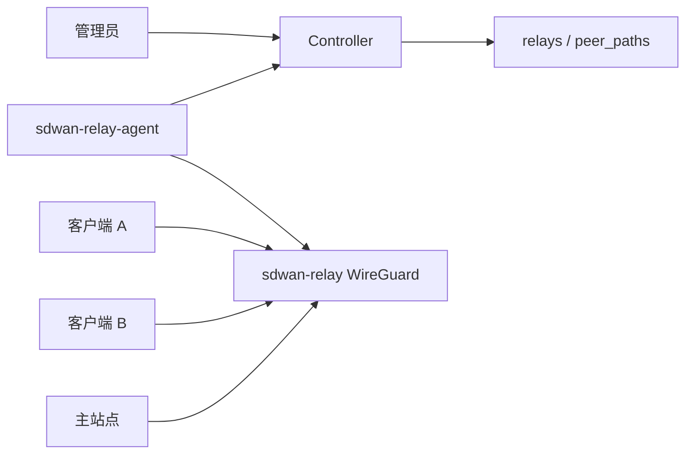

# 服务器端：中继服务

## 1. 当前准确状态

当前版本提供可运行的账户级 WireGuard Hub Relay，并在单主站点拓扑下支持按客户端独立自动 fallback。

已经实现：

- Relay 数据表和 Token。
- 管理台创建、启用、禁用 Relay。
- `direct`、`auto`、`relay` 三种账户路径模式。
- `sdwan-relay-agent` 拉取 peer 并同步 `sdwan-relay`。
- Netmap 同时保留直连和 Relay 候选，并通过唯一 AllowedIPs 归属切换路径。
- Relay 心跳。
- 30 秒直连失败切换、60 秒 Relay 最短驻留和 30 秒直连恢复。

尚未实现：

- 多 Relay 选择、容量调度、地域选择和高可用。
- DERP-like 用户态流量中继协议。
- 完整健康判断、流量统计和带宽计费。

主要代码：

```text
cmd/relay-agent/main.go
internal/relayagent/
internal/app/service.go
db/migrations/000004_add_relay_mode.up.sql
db/queries/relays.sql
```

## 2. 当前 MVP 架构



Relay 是每个账户独立配置的逻辑节点：

- Relay 保存账户 ID、公钥、公网 endpoint、虚拟 IP 和状态。
- Relay Token 只允许该 Relay 拉取所属账户 peer。
- 同一账户当前只使用一个活动 Relay。
- 自动模式下 Controller 同时下发直连和 Relay peer，只有目标路径拥有业务 AllowedIPs。

## 3. 控制流程

### 3.1 创建 Relay

管理员提交：

```text
name
public_key
endpoint
virtual_ip（默认 100.254.253.1）
```

Controller 返回 Relay 元数据和明文 `relay_token`。数据库只保存 Token hash。

### 3.2 启用 Relay

- 启用一个 Relay 时，Controller 会禁用同账户其他活动 Relay。
- Relay 状态变为 `active`。
- 启用 Relay 节点不会自动切换账户流量。
- 只有 `relay` 套餐具备 `enable_self_relay` 能力。

### 3.3 Relay Agent 同步

默认每 5 秒：

```text
GET /api/v1/relays/peers
  -> 返回账户内所有活动设备
  -> 主站点 peer 同时携带已批准子网 CIDR
  -> wg set sdwan-relay peer ... allowed-ips ...
POST /api/v1/relays/heartbeat
```

### 3.4 客户端下发

自动或强制 Relay 模式下客户端 netmap：

- `Peers` 同时包含直连和 Relay 候选。
- 当前目标路径拥有对端 `/32` 与相关子网路由；探测路径 AllowedIPs 为空。
- 非主站点客户端还会把已批准子网路由指向 Relay。
- 客户端使用 Relay 固定公网 endpoint 和 `PersistentKeepalive=25`。

这意味着账户内流量都先进入 Relay，再由 Relay 宿主机转发到目标 peer。

## 4. Relay 宿主机要求

当前 Relay Agent 只负责动态维护 WireGuard peer，不负责自动完成全部宿主机网络初始化。

宿主机需要预先具备：

- Linux 和 WireGuard 工具 `wg`。
- 已创建并启动的 `sdwan-relay` 接口。
- 固定公网 UDP 端口和防火墙放行。
- 正确的 Relay 私钥、公钥和公网 endpoint。
- `net.ipv4.ip_forward=1`。
- 允许 `sdwan-relay -> sdwan-relay` 的 peer 间转发规则。
- 如需访问主站点 LAN，需保证相关 CIDR 路由和 FORWARD 规则正确。

示意规则需要结合发行版防火墙调整：

```bash
sysctl -w net.ipv4.ip_forward=1
iptables -A FORWARD -i sdwan-relay -o sdwan-relay -j ACCEPT
```

Relay 转发 overlay 流量通常不需要对 overlay 地址做 NAT；访问实际 LAN 时，NAT 是否发生应由主站点子网网关策略决定。

## 5. 配置示例

`/etc/sdwan/relay-agent.json`：

```json
{
  "controller_url": "https://controller.englishlisten.cn",
  "relay_token": "relay-token-from-controller",
  "interface_name": "sdwan-relay",
  "sync_interval_seconds": 5,
  "remove_stale_peers": false
}
```

运行：

```bash
sudo sdwan-relay-agent --config /etc/sdwan/relay-agent.json
```

## 6. 与发现服务的区别

| 项目 | 发现服务 | Relay 服务 |
|---|---|---|
| 主要目的 | 观察真实 endpoint | 转发客户端业务流量 |
| 范围 | 全平台公共 Bootstrap | 单账户 Relay |
| 数据面转发 | 不是主要职责 | 是 |
| Token | 全局 Bootstrap Token | 每个 Relay 独立 Token |
| 客户端配置 | 附加固定 Bootstrap peer | 自动模式下与直连 peer 同时保留 |
| 直连失败处理 | 提供 endpoint | Controller 状态机自动切换 |

## 7. 当前风险

- Relay 健康判断当前只基于 15 秒心跳窗口，不包含带宽和公网质量。
- 没有多 Relay 冗余和切换。
- Relay Agent 复用了 Bootstrap 的 `WGManager`，日志和错误命名仍带 bootstrap 语义。
- 仓库暂未提供正式的 Relay systemd unit 和完整安装脚本。
- 没有带宽、连接数、丢包、延迟和流量统计。
- 没有对恶意 peer、AllowedIPs 冲突和资源耗尽做完善防护。

## 8. 建议的正式实现路线

第一阶段：把现有 MVP 工程化。

- 增加 `sdwan-relay-agent.service` 和安装脚本。
- 自动检查 IP forwarding、防火墙和 WireGuard 接口。
- 增加 Relay 健康状态和心跳超时。
- Controller 在 Relay 不健康时拒绝开启模式或自动恢复直连 netmap。

第二阶段：增强现有 fallback。

- 增加主动连通性探测、延迟和丢包指标。
- 增加 Relay 故障时的紧急回直连策略。

第三阶段：多 Relay 和运营能力。

- Relay 注册区域、容量和公网质量。
- 按账户、地域和负载选择 Relay。
- 增加高可用、限速、流量统计、告警和审计。
