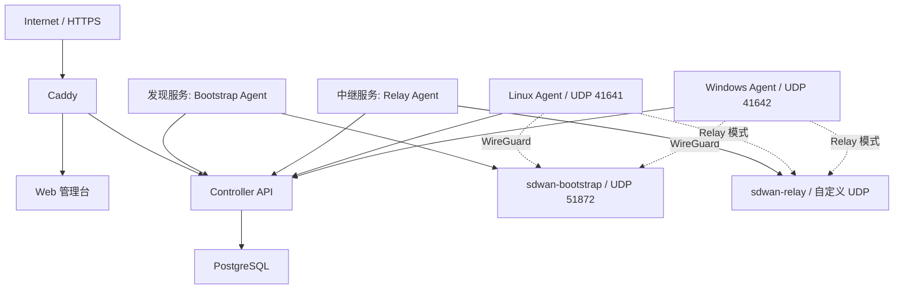

# SD-WAN 部署手册

本文档适用于当前 `v1.2.0`，统一说明服务器端三个服务和 Linux、Windows 客户端的部署方式。

## 1. 部署组成



推荐将 Controller、Web、PostgreSQL、Caddy 和 Bootstrap Agent 部署在同一台固定公网 Linux 服务器。Relay 可以部署在同一台服务器，也可以部署在另一台独立公网 Linux 服务器。

## 2. 端口和域名

| 用途 | 地址/端口 | 对公网开放 |
|---|---|---|
| Web 和 Controller HTTPS | TCP 443 | 是 |
| HTTP 跳转和证书签发 | TCP 80 | 是 |
| Controller 宿主机端口 | TCP 18080 | 否，只允许本机 |
| Web 宿主机端口 | TCP 8081 | 否，只允许本机 |
| Bootstrap WireGuard | UDP 51872 | 是 |
| Relay WireGuard | 自定义 UDP，例如 51873 | 是 |
| Linux Agent WireGuard | UDP 41641 | 视直连策略而定 |
| Windows Agent WireGuard | UDP 41642 | 视直连策略而定 |

生产域名示例：

```text
controller.englishlisten.cn
```

DNS A/AAAA 记录需要指向 Controller 公网服务器。

---

# 第一部分：服务器端部署

## 3. 控制器服务部署

控制器部分包含：

```text
Controller API
Vue Web
PostgreSQL
Caddy
```

### 3.1 服务器要求

- Ubuntu 22.04/24.04 或其他现代 Linux。
- 建议至少 2 核 CPU、2 GB 内存、20 GB 磁盘。
- 已安装 Git、Docker Engine、Docker Compose Plugin。
- 已安装 Caddy。
- TCP 80/443 对公网开放。
- 建议部署目录 `/opt/sdwan`。

Ubuntu 安装基础依赖：

```bash
sudo apt update
sudo apt install -y git ca-certificates curl caddy

curl -fsSL https://get.docker.com | sudo sh
sudo systemctl enable --now docker
```

### 3.2 获取代码

当前发布版本是 `v1.2.0`，包含 Resend 配置修复、Windows 安装包以及按客户端自动 Relay fallback：

```bash
sudo mkdir -p /opt/sdwan
sudo chown "$USER":"$USER" /opt/sdwan
git clone https://github.com/fansboyu/sdwan.git /opt/sdwan
cd /opt/sdwan
git checkout v1.2.0
```

升级现有部署前应先升级全部 Linux/Windows 客户端到 `v1.2.0`，再启用自动中继模式。

### 3.3 配置环境变量

创建 `/opt/sdwan/.env`：

```bash
cd /opt/sdwan
umask 077
cat > .env <<'EOF'
BOOTSTRAP_REPORT_TOKEN=替换为强随机字符串
BOOTSTRAP_WG_PUBLIC_KEY=稍后填写Bootstrap公钥
BOOTSTRAP_WG_ENDPOINT=controller.englishlisten.cn:51872
BOOTSTRAP_WG_ALLOWED_IP=100.254.254.254/32

RESEND_API_KEY=替换为Resend_API_Key
RESEND_FROM=SD-WAN Controller <noreply@mail.englishlisten.cn>
EMAIL_CODE_TTL_SECONDS=600
EMAIL_CODE_COOLDOWN_SECONDS=60
EMAIL_CODE_MAX_ATTEMPTS=5
EOF
chmod 600 .env
```

生成 Bootstrap Token：

```bash
openssl rand -hex 32
```

注意：

- API key、Token 和私钥不能提交到 Git。
- `mail.englishlisten.cn` 必须在 Resend 中验证成功。
- 当前 Compose 内的 PostgreSQL 默认用户名和密码适合 MVP，正式运营前应改为强密码并同步修改 `DATABASE_URL`。

### 3.4 启动 Compose 服务

```bash
cd /opt/sdwan
sudo docker compose up -d --build postgres controller web
```

当前 Compose 将宿主机 `18080` 和 `8081` 映射到所有网卡。生产环境必须使用云防火墙/UFW 阻止公网直接访问这两个端口，或者把 Compose 端口改成 `127.0.0.1:18080:8080` 和 `127.0.0.1:8081:80`，仅允许 Caddy 访问。

查看状态：

```bash
sudo docker compose ps
sudo docker compose logs --tail=100 controller
curl -fsS http://127.0.0.1:18080/healthz
curl -fsS http://127.0.0.1:18080/api/v1/server/version
```

Controller 首次启动会自动执行数据库 migration。

### 3.5 配置 Caddy

安装仓库中的 Caddyfile：

```bash
sudo cp /opt/sdwan/deploy/caddy/Caddyfile /etc/caddy/Caddyfile
sudo caddy validate --config /etc/caddy/Caddyfile
sudo systemctl reload caddy
```

验证：

```bash
curl -fsS https://controller.englishlisten.cn/healthz
curl -fsS https://controller.englishlisten.cn/api/v1/server/version
```

### 3.6 准备客户端下载文件

创建发布目录并构建 Linux 程序：

```bash
cd /opt/sdwan
sudo mkdir -p downloads/v1.2.0

CGO_ENABLED=0 GOOS=linux GOARCH=amd64 go build \
  -o downloads/v1.2.0/sdwan-agent-linux-amd64 ./cmd/agent

CGO_ENABLED=0 GOOS=linux GOARCH=amd64 go build \
  -o downloads/v1.2.0/sdwan-bootstrap-agent-linux-amd64 ./cmd/bootstrap-agent

CGO_ENABLED=0 GOOS=linux GOARCH=amd64 go build \
  -o downloads/v1.2.0/sdwan-relay-agent-linux-amd64 ./cmd/relay-agent

chmod 755 downloads/v1.2.0/*
cp deploy/install/install.sh downloads/install.sh
chmod 755 downloads/install.sh
```

如果服务器没有 Go，可在开发机交叉编译后上传至相同目录。

公开下载验证：

```bash
curl -I https://controller.englishlisten.cn/install.sh
curl -I https://controller.englishlisten.cn/downloads/v1.2.0/sdwan-agent-linux-amd64
```

## 4. 发现服务部署

发现服务必须运行在具有固定公网 UDP 地址的 Linux 宿主机上，通常就是 Controller 所在服务器。

### 4.1 安装 WireGuard

```bash
sudo apt update
sudo apt install -y wireguard-tools iproute2
```

### 4.2 生成 Bootstrap 密钥

```bash
sudo install -d -m 700 /etc/wireguard
sudo sh -c 'umask 077; wg genkey > /etc/wireguard/sdwan-bootstrap.key'
sudo sh -c 'wg pubkey < /etc/wireguard/sdwan-bootstrap.key > /etc/wireguard/sdwan-bootstrap.pub'
sudo cat /etc/wireguard/sdwan-bootstrap.pub
```

把输出的公钥写入 `/opt/sdwan/.env`：

```text
BOOTSTRAP_WG_PUBLIC_KEY=这里填写公钥
```

然后重建 Controller，使新的 Bootstrap peer 配置进入环境变量：

```bash
cd /opt/sdwan
sudo docker compose up -d --no-deps --force-recreate controller
```

### 4.3 创建 Bootstrap WireGuard 接口

```bash
BOOTSTRAP_PRIVATE_KEY="$(sudo cat /etc/wireguard/sdwan-bootstrap.key)"

sudo tee /etc/wireguard/sdwan-bootstrap.conf >/dev/null <<EOF
[Interface]
Address = 100.254.254.254/32
ListenPort = 51872
PrivateKey = ${BOOTSTRAP_PRIVATE_KEY}
PostUp = ip route replace 100.64.0.0/10 dev %i
PostDown = ip route del 100.64.0.0/10 dev %i 2>/dev/null || true
EOF

sudo chmod 600 /etc/wireguard/sdwan-bootstrap.conf
sudo systemctl enable --now wg-quick@sdwan-bootstrap
```

不要把私钥写进仓库或 Controller 环境变量。

### 4.4 放行端口

云安全组和主机防火墙需要放行：

```text
UDP 51872
```

UFW 示例：

```bash
sudo ufw allow 51872/udp
```

### 4.5 安装 Bootstrap Agent

```bash
sudo install -m 0755 \
  /opt/sdwan/downloads/v1.2.0/sdwan-bootstrap-agent-linux-amd64 \
  /usr/local/bin/sdwan-bootstrap-agent

sudo install -d -m 700 /etc/sdwan
```

创建 `/etc/sdwan/bootstrap-agent.json`，其中 Token 必须和 Controller `.env` 中的 `BOOTSTRAP_REPORT_TOKEN` 完全一致：

```bash
sudo tee /etc/sdwan/bootstrap-agent.json >/dev/null <<'EOF'
{
  "controller_url": "https://controller.englishlisten.cn",
  "bootstrap_token": "替换为BOOTSTRAP_REPORT_TOKEN",
  "interface_name": "sdwan-bootstrap",
  "sync_interval_seconds": 5,
  "report_interval_seconds": 2,
  "remove_stale_peers": false
}
EOF
sudo chmod 600 /etc/sdwan/bootstrap-agent.json
```

安装并启动 systemd：

```bash
sudo install -m 0644 \
  /opt/sdwan/deploy/systemd/sdwan-bootstrap-agent.service \
  /etc/systemd/system/sdwan-bootstrap-agent.service

sudo systemctl daemon-reload
sudo systemctl enable --now sdwan-bootstrap-agent
```

### 4.6 验证发现服务

```bash
sudo systemctl status wg-quick@sdwan-bootstrap --no-pager
sudo systemctl status sdwan-bootstrap-agent --no-pager
sudo journalctl -u sdwan-bootstrap-agent -n 100 --no-pager
sudo wg show sdwan-bootstrap
ip route get 100.64.0.1
sudo ss -lunp | grep 51872
```

预期结果：

- `sdwan-bootstrap` 接口处于 UP。
- 存在 `100.64.0.0/10 dev sdwan-bootstrap` 路由。
- Bootstrap Agent 能从 Controller 拉取设备 peer。
- 客户端上线后 `wg show` 出现 handshake 和 endpoint。
- Web 设备详情中出现 `bootstrap` 类型 endpoint。

## 5. 中继服务部署

当前中继服务是账户级 WireGuard Hub MVP，默认不必部署。只有启用“自行搭建 Relay”功能的账户需要部署。

建议 Relay 使用独立公网 Linux 主机。以下示例使用：

```text
接口：sdwan-relay
虚拟 IP：100.254.253.1/32
UDP：51873
```

先安装依赖：

```bash
sudo apt update
sudo apt install -y wireguard-tools iproute2 iptables curl
```

### 5.1 在管理台创建 Relay

准备 Relay WireGuard 密钥：

```bash
sudo install -d -m 700 /etc/wireguard
sudo sh -c 'umask 077; wg genkey > /etc/wireguard/sdwan-relay.key'
sudo sh -c 'wg pubkey < /etc/wireguard/sdwan-relay.key > /etc/wireguard/sdwan-relay.pub'
sudo cat /etc/wireguard/sdwan-relay.pub
```

在 Web 管理台创建 Relay，填写：

```text
名称：自定义
公钥：sdwan-relay.pub 内容
Endpoint：relay.example.com:51873 或 公网IP:51873
Virtual IP：100.254.253.1
```

创建后只会返回一次 Relay Token，请立即保存到 Relay 服务器的受保护配置文件中。

### 5.2 创建 Relay WireGuard 接口

```bash
RELAY_PRIVATE_KEY="$(sudo cat /etc/wireguard/sdwan-relay.key)"

sudo tee /etc/wireguard/sdwan-relay.conf >/dev/null <<EOF
[Interface]
Address = 100.254.253.1/32
ListenPort = 51873
PrivateKey = ${RELAY_PRIVATE_KEY}
PostUp = sysctl -w net.ipv4.ip_forward=1
PostUp = iptables -C FORWARD -i %i -o %i -j ACCEPT 2>/dev/null || iptables -A FORWARD -i %i -o %i -j ACCEPT
PostDown = iptables -D FORWARD -i %i -o %i -j ACCEPT 2>/dev/null || true
EOF

sudo chmod 600 /etc/wireguard/sdwan-relay.conf
sudo systemctl enable --now wg-quick@sdwan-relay
sudo ufw allow 51873/udp
```

还应持久化 IPv4 forwarding：

```bash
echo 'net.ipv4.ip_forward=1' | sudo tee /etc/sysctl.d/90-sdwan-relay.conf
sudo sysctl --system
```

### 5.3 安装 Relay Agent

可以从 Controller 下载：

```bash
sudo curl -fsSL \
  https://controller.englishlisten.cn/downloads/v1.2.0/sdwan-relay-agent-linux-amd64 \
  -o /usr/local/bin/sdwan-relay-agent
sudo chmod 755 /usr/local/bin/sdwan-relay-agent
sudo install -d -m 700 /etc/sdwan
```

创建 `/etc/sdwan/relay-agent.json`：

```bash
sudo tee /etc/sdwan/relay-agent.json >/dev/null <<'EOF'
{
  "controller_url": "https://controller.englishlisten.cn",
  "relay_token": "替换为管理台返回的Relay_Token",
  "interface_name": "sdwan-relay",
  "sync_interval_seconds": 5,
  "remove_stale_peers": false
}
EOF
sudo chmod 600 /etc/sdwan/relay-agent.json
```

### 5.4 创建 Relay systemd 服务

当前仓库尚未内置 Relay systemd unit，需要手工创建：

```bash
sudo tee /etc/systemd/system/sdwan-relay-agent.service >/dev/null <<'EOF'
[Unit]
Description=SD-WAN Relay Agent
After=network-online.target wg-quick@sdwan-relay.service
Wants=network-online.target
Requires=wg-quick@sdwan-relay.service

[Service]
Type=simple
ExecStart=/usr/local/bin/sdwan-relay-agent --config /etc/sdwan/relay-agent.json
Restart=always
RestartSec=3
User=root

[Install]
WantedBy=multi-user.target
EOF

sudo systemctl daemon-reload
sudo systemctl enable --now sdwan-relay-agent
```

### 5.5 启用 Relay 模式

部署完成并确认 Relay 心跳正常后：

1. 在管理台启用该 Relay。
2. 开启账户 Relay 模式。
3. 客户端下一次 poll 会收到新的 netmap。
4. 客户端 peer 将切换为 Relay。

`v1.2.0` 支持直连、自动中继和强制中继。自动模式要求 Relay 最近 15 秒有心跳，并要求所有活动客户端至少为 `v1.2.0`。

### 5.6 验证 Relay

```bash
sudo systemctl status wg-quick@sdwan-relay --no-pager
sudo systemctl status sdwan-relay-agent --no-pager
sudo journalctl -u sdwan-relay-agent -n 100 --no-pager
sudo wg show sdwan-relay
sudo ss -lunp | grep 51873
sysctl net.ipv4.ip_forward
sudo iptables -C FORWARD -i sdwan-relay -o sdwan-relay -j ACCEPT
```

预期：

- 管理台 Relay 的 `last_seen_at` 持续更新。
- `sdwan-relay` 上存在账户内设备 peer。
- 客户端 netmap 只有活动 Relay 作为主要 peer。
- 客户端之间的 overlay 流量经过 Relay 转发。

---

# 第二部分：客户端部署

## 6. Linux 客户端部署

### 6.1 一键安装

当前安装脚本只支持 Linux amd64：

```bash
curl -fsSL https://controller.englishlisten.cn/install.sh | sudo sh
```

脚本会：

- 安装 `curl`、CA 证书和 `wireguard-tools`。
- 下载 `v1.2.0` Linux Agent。
- 安装到 `/usr/local/bin/sdwan-agent`。
- 创建 `/etc/sdwan` 和 `/etc/wireguard`。
- 安装 `sdwan-agent.service`。

### 6.2 注册设备

在 Web 管理台登录并复制 Admin Token：

```bash
sudo sdwan-agent register \
  --controller https://controller.englishlisten.cn \
  --admin-token sdwan_admin_xxx
```

注册后生成：

```text
/etc/sdwan/agent.json
```

### 6.3 启动服务

```bash
sudo systemctl enable --now sdwan-agent
```

验证：

```bash
sudo systemctl status sdwan-agent --no-pager
sudo journalctl -u sdwan-agent -n 100 --no-pager
sudo wg show sdwan0
ip addr show sdwan0
ip route show dev sdwan0
```

### 6.4 Linux 主站点和子网路由

1. 在管理台把该设备设置为主站点。
2. 客户端添加需要发布的 LAN CIDR：

```bash
sudo sdwan-agent routes add 192.168.50.0/24
```

3. 在管理台审批路由。
4. 在主站点开启转发和 NAT：

```bash
sudo sdwan-agent subnet-gateway enable \
  --lan-cidr 192.168.50.0/24
```

`--out-interface` 可省略，Agent 会根据到 LAN 探测目标的系统路由自动推断；也可以显式填写实际连接 LAN 的接口。默认探测目标为 LAN CIDR 的第一个可用地址，也可通过 `--lan-target 192.168.50.1` 指定网关或稳定在线的内网主机。

## 7. Windows 客户端部署

推荐优先使用单文件安装包：

```text
SD-WAN-Setup-v1.2.0-x64.exe
```

安装包自动请求管理员权限，将三个运行文件安装到 `C:\Program Files\SD-WAN`，并安装 `SDWANService`。安装后仍然采用复制 Admin Token、点击 `Join from Clipboard` 的入网方式。

构建安装包：

```powershell
powershell -ExecutionPolicy Bypass -File .\deploy\windows\build-installer.ps1
```

输出位置：

```text
dist\windows\SD-WAN-Setup-v1.2.0-x64.exe
```

### 7.1 发布文件

准备目录：

```text
C:\sdwan\
  sdwan-service.exe
  sdwan-tray.exe
  wintun.dll
```

其中 `wintun.dll` 必须与 `sdwan-service.exe` 在同一目录。

### 7.2 从源码构建

在项目根目录执行：

```powershell
$env:GOOS="windows"
$env:GOARCH="amd64"

go build -o build\windows\sdwan-service.exe .\cmd\windows-service
go build -ldflags="-H windowsgui" -o build\windows\sdwan-tray.exe .\cmd\windows-tray
```

将两个 EXE 和官方 `wintun.dll` 复制到 `C:\sdwan`。

### 7.3 托盘方式部署

使用管理员权限打开 PowerShell：

```powershell
cd C:\sdwan
.\sdwan-tray.exe
```

然后：

1. 登录 Web 管理台并复制 Admin Token。
2. 在托盘菜单选择 `Join from Clipboard`。
3. 选择 `Connect`。
4. 托盘会安装并启动 `SDWANService`。

### 7.4 命令行方式部署

```powershell
cd C:\sdwan

.\sdwan-service.exe register `
  --controller https://controller.englishlisten.cn `
  --admin-token sdwan_admin_xxx

.\sdwan-service.exe install-service --auto-start=true
.\sdwan-service.exe start-service
```

验证：

```powershell
.\sdwan-service.exe status
.\sdwan-service.exe diagnose
Get-Service SDWANService
Get-NetAdapter
Get-NetRoute
```

Windows 配置保存在：

```text
C:\ProgramData\sdwan\agent.json
C:\ProgramData\sdwan\tray.json
```

当前 Windows 客户端不能作为子网网关，但可以访问 Linux 主站点发布并审批的子网。

---

# 第三部分：运维

## 8. 推荐部署顺序

```text
1. DNS 指向 Controller 公网服务器
2. 部署 PostgreSQL、Controller、Web
3. 配置 Caddy 和 HTTPS
4. 部署 Bootstrap WireGuard 和 Bootstrap Agent
5. 构建并发布客户端下载文件
6. 注册 Linux/Windows 客户端
7. 验证 endpoint、握手和 overlay 通信
8. 按需部署 Relay
9. Relay 健康后再开启账户 Relay 模式
```

## 9. 整体验证清单

控制器：

```bash
curl -fsS https://controller.englishlisten.cn/healthz
curl -fsS https://controller.englishlisten.cn/api/v1/server/version
```

发现服务：

```bash
sudo wg show sdwan-bootstrap
sudo journalctl -u sdwan-bootstrap-agent -n 50 --no-pager
```

Linux 客户端：

```bash
sudo wg show sdwan0
ping <另一设备虚拟IP>
```

Windows 客户端：

```powershell
C:\sdwan\sdwan-service.exe diagnose
ping <另一设备虚拟IP>
```

Relay：

```bash
sudo wg show sdwan-relay
sudo journalctl -u sdwan-relay-agent -n 50 --no-pager
```

## 10. 版本升级

### 10.1 Controller 升级

先备份数据库和 `.env`：

```bash
cd /opt/sdwan
sudo mkdir -p backups
sudo cp .env "backups/.env.$(date +%Y%m%d-%H%M%S)"
sudo docker compose exec -T postgres \
  pg_dump -U sdwan -d sdwan \
  > "backups/sdwan.$(date +%Y%m%d-%H%M%S).sql"
```

升级代码：

```bash
cd /opt/sdwan
git fetch --tags
git checkout <新版本tag>
sudo docker compose up -d --build controller web
```

Controller 启动时自动执行新的 migration。

### 10.2 Linux Agent 升级

```bash
sudo env SDWAN_VERSION=<新版本tag> \
  sh -c 'curl -fsSL https://controller.englishlisten.cn/install.sh | sh'
sudo systemctl restart sdwan-agent
```

### 10.3 Bootstrap/Relay Agent 升级

替换 `/usr/local/bin` 中的二进制后重启对应服务：

```bash
sudo systemctl restart sdwan-bootstrap-agent
sudo systemctl restart sdwan-relay-agent
```

### 10.4 Windows Agent 升级

```powershell
cd C:\sdwan
.\sdwan-service.exe stop-service
```

替换 `sdwan-service.exe` 和 `sdwan-tray.exe`，保留 `C:\ProgramData\sdwan` 配置，然后：

```powershell
.\sdwan-service.exe start-service
.\sdwan-service.exe diagnose
```

## 11. 回滚原则

- 回滚前保留当前 `.env`、数据库备份和客户端配置。
- 数据库 migration 发生结构变化时，不要仅回滚镜像而忽略数据库兼容性。
- Controller 回滚后检查 `/api/v1/server/version`。
- 客户端回滚时保留 Device Token、私钥和虚拟 IP 配置。
- 自动模式会按客户端独立切换；Relay 故障排查时可在管理台切到“直连”模式恢复普通 netmap。

## 12. 安全要求

- 所有 `.env`、Agent JSON、WireGuard 私钥权限设为 `0600`。
- 不在日志、命令历史或 Git 中保存明文 API key 和 Token。
- Controller 只通过 HTTPS 暴露。
- PostgreSQL、18080 和 8081 不直接暴露公网。
- Bootstrap Token 和每个 Relay Token 必须不同。
- 定期轮换 Resend API key、服务 Token 和管理员凭证。
- 正式运营前修改 PostgreSQL 默认密码，并配置数据库备份策略。
